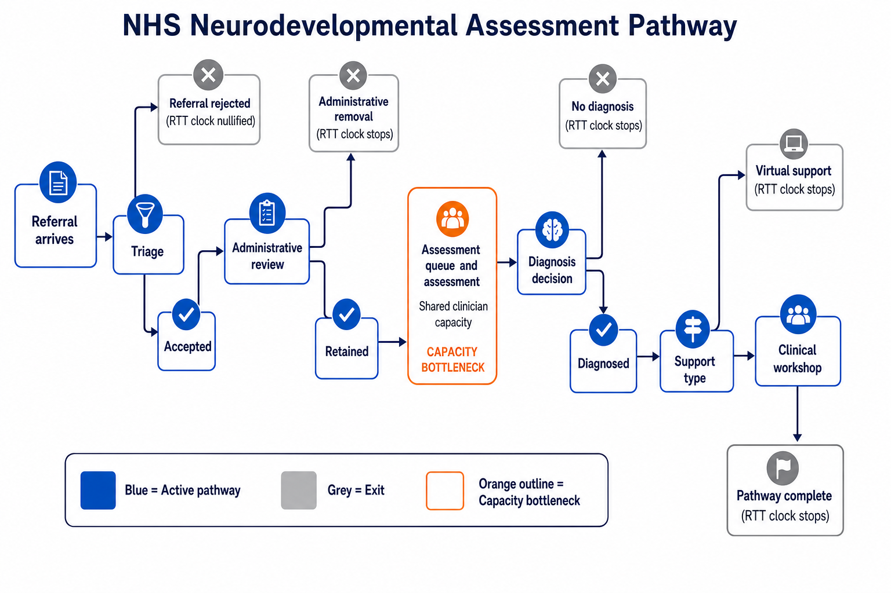

[](https://autismpathway.streamlit.app/)

# NHS Neurodevelopmental Assessment Pathway — Discrete Event Simulation

## Abstract — what problem we solve and how

Neurodevelopmental assessment services face **rising referrals**, **fixed weekday clinician capacity**, and long **Patient Tracking List (PTL)** backlogs. Teams must report **referral-to-treatment (RTT)** performance, **18-week / 52-week** access standards, and the effect of policy levers (capacity, triage, admin removal) before committing resources.

This project is a **discrete-event simulation (DES)** of the NHS pathway from referral to exit. Referrals arrive stochastically, compete for a **shared pool of clinician hours**, pass triage and admin review, complete multi-appointment assessments, receive a diagnosis, and leave via **virtual support** or a **clinical workshop programme**. The engine (SimPy) jumps between events so multi-year horizons remain tractable.

We answer planning questions in three layers:

| Question | Approach |
|----------|----------|
| When does the model match observed backlog (PTL)? | **Run 1** — search simulation horizon **T\*** |
| How uncertain are KPIs if nothing changes? | **Run 2** — many replications at **T\*** with 95% CIs |
| What happens after a policy change at **T\***? | **Run 3** — switch parameters and measure backlog decay vs control |

KPIs separate **stock** (who is on the pathway at the horizon) from **flow** (throughput and recent completions in a rolling window). Definitions: [`GLOSSARY.md`](GLOSSARY.md).

---

## Pathway flow

Referrals → triage → admin review → assessment (capacity bottleneck) → diagnosis → virtual or workshop support → exit. Incomplete pathways at the horizon count on the **PTL / backlog**.



---

## How to use the model

All runners live in [`des/runners.py`](des/runners.py). KPI tables are built by [`des/run_report.py`](des/run_report.py) (`RunReport`, `kpi_snapshot`). Work from the **repository root** so `import des` resolves.

### Pipeline (every run)

```
Experiment → AutismPathwaySystem (SimPy) → Audit → build_run_report → RunReport
```

### `single_run` — one stochastic replication

Runs one seed to a horizon `run_length` (days). Returns:

| Output | Meaning |
|--------|---------|
| `patients` | One row per referral; milestone times from the audit |
| `capacity` | Weekday clinician hours released / used |
| `model_params` | Scenario settings (`Experiment.to_kwargs()`) |
| `report` | KPI DataFrames at horizon + flow window |

```python
from des.audit import Audit
from des.experiment import Experiment
from des.runners import single_run

experiment = Experiment(audit=Audit(), scenario_name="baseline", ...)  # see demo.ipynb

patients, capacity, model_params, report = single_run(
    experiment,
    rep=0,
    run_length=365 * 5,
    warm_up=0,
    flow_window_days=365.0,
)

report.pathway_funnel          # counts at horizon
report.rtt_waits_stock         # backlog vs completed RTT
report.waits_stock_by_stage    # waits by stage (stock)
```

Tutorial: [`demo.ipynb`](demo.ipynb).

### `multiple_replication` — uncertainty across seeds

Repeats `single_run` with `rep = 0, 1, …`. Use `summarise_replications` for mean, SD, and 95% CI on each KPI section.

```python
from des.runners import multiple_replication, summarise_replications

results = multiple_replication(experiment, n_reps=10, run_length=365 * 5, warm_up=0)
summary = summarise_replications(results)   # ReplicationReport
summary.rtt_waits_stock
```

### Run 1 — calibrate horizon **T\***

Steps the simulation horizon (e.g. yearly) until headline KPIs are within a tolerance of **provider targets** (e.g. PTL size). Returns **T\***, MAPE history, and whether a match was found.

```python
from des.runners import run1

run1_result = run1(
    experiment,
    targets={"waiting_list_size_all_in_system": 2835},
    max_period_days=18 * 365,
    step_days=365,
    match_tolerance=0.05,
)
T_STAR = run1_result["optimal_matching_period_days"]
run1_result["history"]
```

Legacy target names map to canonical KPIs (e.g. `waiting_list_size_all_in_system` → backlog at horizon).

### Run 2 — stochastic baseline at **T\***

Runs `multiple_replication` at horizon **T\*** from Run 1. Outputs per-rep snapshots and summarised CIs (`run2_result["summary"]`, `run2_result["kpi_snapshots"]`).

```python
from des.runners import run2

run2_result = run2(
    experiment,
    matching_period_days=T_STAR,
    n_reps=20,
    flow_window_days=365.0,
)
```

### Run 3 — policy switch and backlog decay

Simulates continuously to **T\***, applies **policy overrides** (e.g. extra clinician hours), runs a **decay window**, and optionally compares to a **control** arm with no change. Paired replications give policy − baseline deltas.

```python
from des.runners import run3

run3_result = run3(
    experiment,
    matching_period_days=T_STAR,
    decay_period_days=365 * 2,
    policy_overrides={"workforce_hours_per_day": 9.0},
    n_reps=5,
    include_control=True,
)
run3_result["comparison"]
run3_result["policy_summary"]["kpi_time_series"]
```

---

## Ways to run the project

| Mode | Where |
|------|--------|
| **Interactive app** | Streamlit badge at top of this page, or `./run_streamlit.sh` locally |
| **Notebook walkthrough** | [`demo.ipynb`](demo.ipynb) — `DEMO_FAST` for short runs |
| **Python scripts / notebooks** | Import `des.runners` as above |
| **Glossary** | [`GLOSSARY.md`](GLOSSARY.md) and **Glossary** page in the app |

---

## Setup

**Pip:**

```bash
pip install -r requirements.txt
jupyter lab demo.ipynb
./run_streamlit.sh
```

**Optional Conda** (`conda/environment.yml`, env `sim_env`):

```bash
conda env create -f conda/environment.yml
conda activate sim_env
```

Streamlit Cloud deployment: [`DEPLOY_STREAMLIT.md`](DEPLOY_STREAMLIT.md) (uses root `requirements.txt`).

---

## Repository layout

```
discrete_event_adhd_sim/
├── des/                    # SimPy model, audit, run_report, runners
├── streamlit_app/          # Run 1–3 UI
├── demo.ipynb              # single_run → Run 1/2/3 tutorial
├── figures/                # pathway diagrams
├── GLOSSARY.md
├── requirements.txt
├── conda/environment.yml
└── tests/
```

---

## Tests and verification

```bash
pytest tests/ -v
python -m des.verification
```

---

## License

See [LICENSE](LICENSE).
