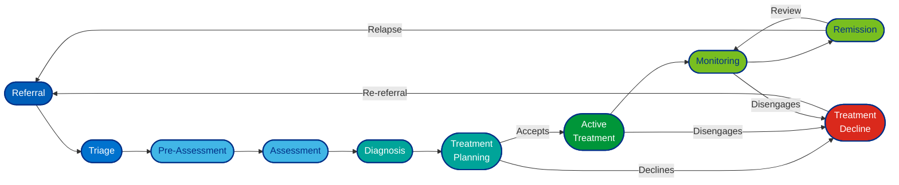

# ADHD Clinical Pathway - State Mapping

## Pathway Diagram



## States and Transitions

```yaml
Referral:
  description: "Patient referred for ADHD evaluation"
  next_states:
    - Triage

Triage:
  description: "Initial screening and prioritization"
  next_states:
    - Pre-Assessment

Pre-Assessment:
  description: "Preparation for formal assessment"
  next_states:
    - Assessment

Assessment:
  description: "Comprehensive clinical evaluation"
  next_states:
    - Diagnosis

Diagnosis:
  description: "ADHD diagnosis confirmed or ruled out"
  next_states:
    - Treatment Planning

Treatment Planning:
  description: "Development of individualized treatment plan"
  next_states:
    - Active Treatment
    - Treatment Decline

Active Treatment:
  description: "Patient engaged in treatment (medication, therapy, behavioral intervention)"
  next_states:
    - Monitoring
    - Treatment Decline

Treatment Decline:
  description: "Patient refuses or unable to continue treatment"
  next_states:
    - Referral  # Re-referral for future assessment

Monitoring:
  description: "Ongoing follow-up and treatment adjustment"
  next_states:
    - Remission
    - Treatment Decline

Remission:
  description: "Symptoms managed; patient stable"
  next_states:
    - Monitoring
    - Referral  # If symptoms return
```

## Quick Reference Table

| State | Type | Duration | Outcome |
|-------|------|----------|---------|
| Referral | Initial | Days-Weeks | → Triage |
| Triage | Screening | Days | → Pre-Assessment |
| Pre-Assessment | Prep | Weeks | → Assessment |
| Assessment | Evaluation | Weeks | → Diagnosis |
| Diagnosis | Clinical | Days | → Treatment Planning |
| Treatment Planning | Planning | Days-Weeks | → Active/Decline |
| Active Treatment | Ongoing | Months-Years | → Monitoring |
| Treatment Decline | Barrier | Variable | → Referral |
| Monitoring | Follow-up | Ongoing | → Remission/Decline |
| Remission | Stable | Ongoing | → Monitoring |
